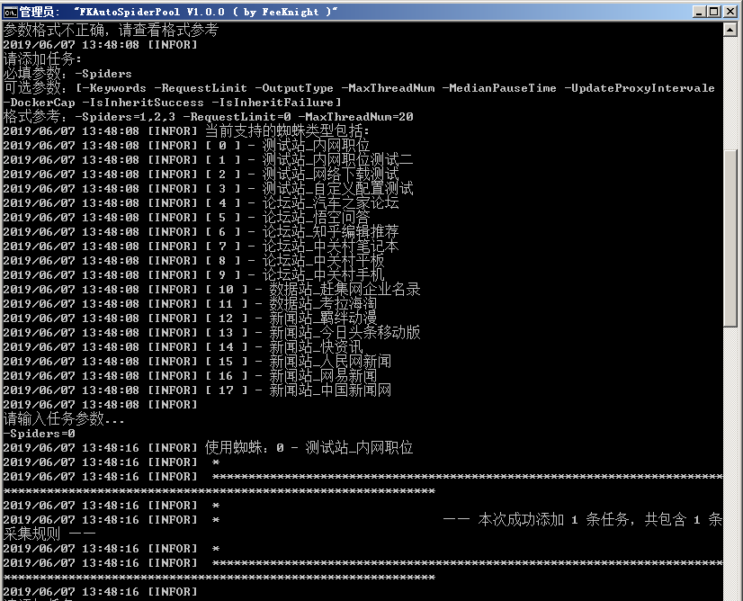
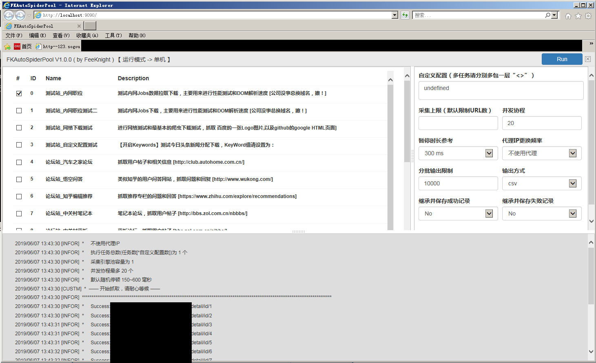
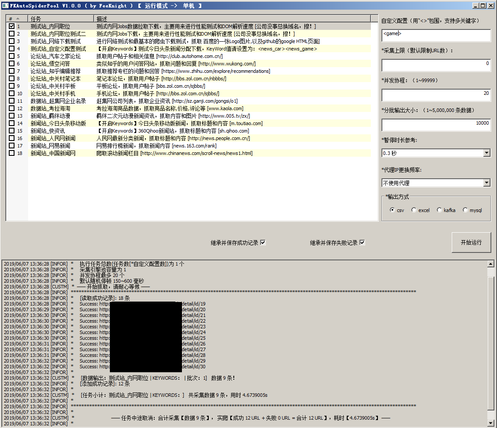
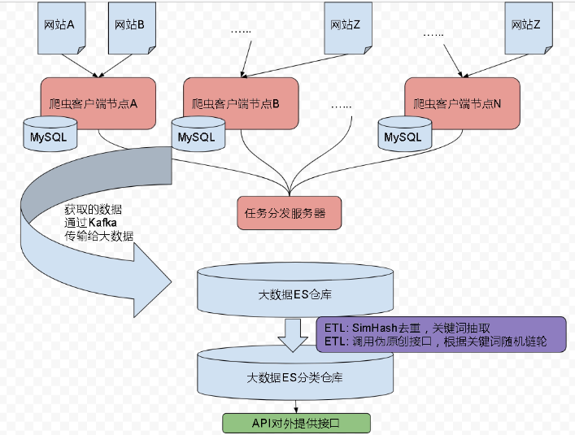
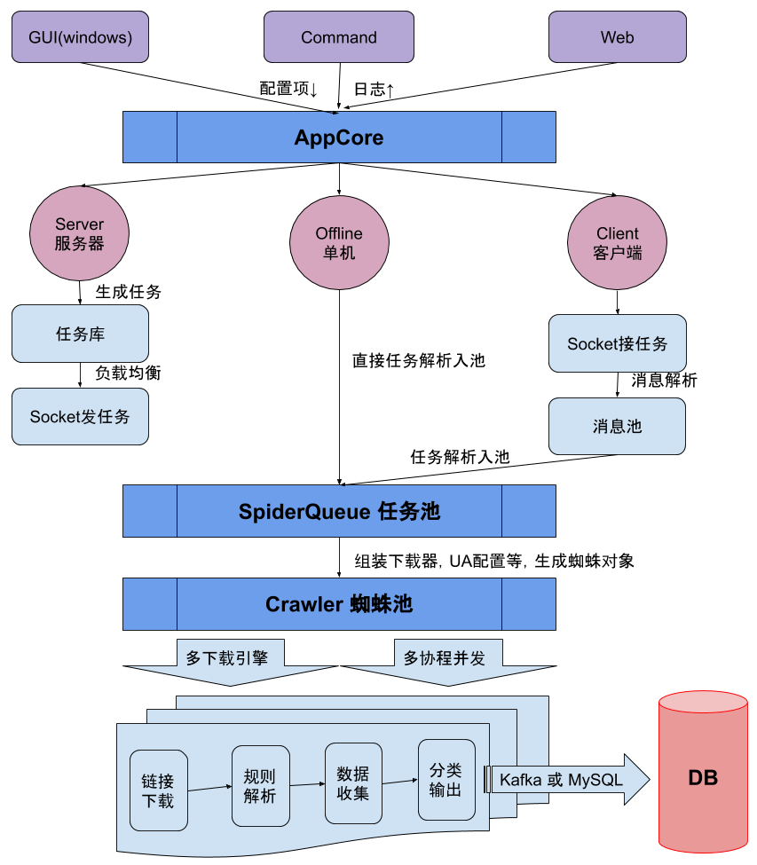
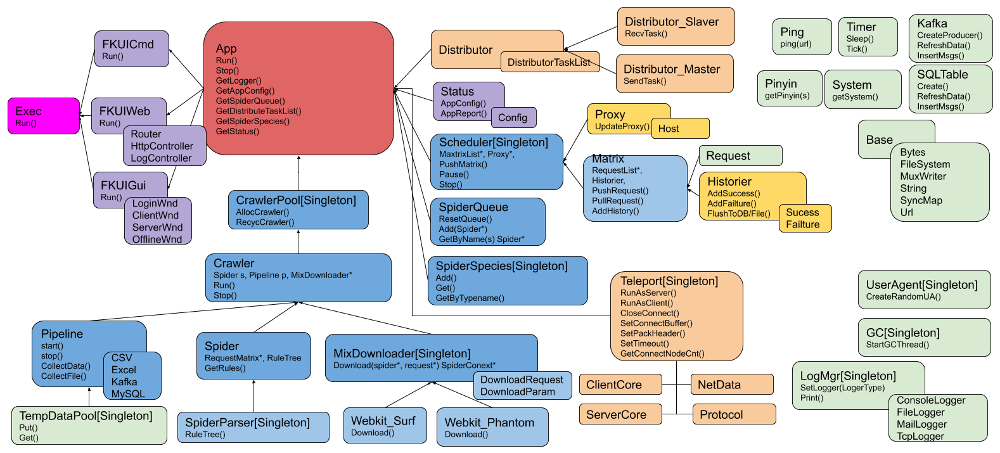

# 自动网页爬虫下载工具

### 基本说明

**这是一个高并发可扩展的脚本爬虫工具。**

- 支持Windows,Linux多平台（命令行，网页，窗口三种机制）
- 支持 服务器，客户端，单机测试 三种运行模式
- 有基本的状态控制，如暂停，恢复，终止等
- 可控制可采集量，采集间歇
- 支持动态代理IP切换，能设置更换频率
- 支持cookie保存和禁用模式，以进行简单的模拟登陆
- 支持随机UserAgent
- 能进行多采集任务并发执行，支持单slave多协程并发
- 提供自定义配置接口 和 采集模板编写
- 支持简易的CSV输出，本地的MySQL输出和Kafka大规模输出
- 支持基本的高并发gosurf采集和更安全的phantom采集
- 支持dom解析以便取得有效内容数据
- 有部分有特点的大网站的脚本规则样例

### 核心结构
- 结构图请参考Doc
- FKScript中是爬虫脚本
- FKTools中是依赖的工具

### 性能记录：

- 设置延时为0时，500线程时，爬取内网无限制的数据并做DOM拆解内容取出，1分钟取得3000条数据。

- 设置延时为0.1s，20线程时，开启VPN爬去外网今日头条数据时，成功查询62359个URL，失败20个URL，成功下载18499条数据并做DOM解析内容取出，花费时间2小时11分钟。

### 资料参考：

- GoQuery选择器格式: https://www.cnblogs.com/diegodu/p/5761961.html

### TODO

- 支持ES数据存储
- 支持规则脚本

### 参考图

